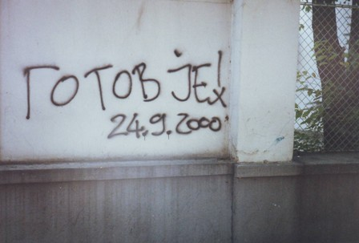
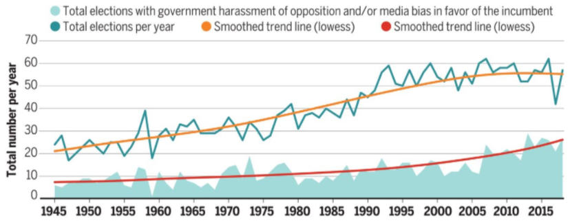

# Brief Summary: He's Finished! Why Some Elections Threaten Authoritarian Rulers

### A Senior Honors Thesis for the UC Berkeley Political Science Department. Advised by Professors Susan Hyde and Terri Bimes.

#### I. A Tale of Two Elections

In 1997 and again in 2000, Serbians went to the polls. In 1997 they were electing a president and a national assembly for Serbia. In 2000, they were choosing a president of the Yugoslav Federation (by that time, a rump entity that included only Serbia and Montenegro). In both elections, however, voters faced the same choice. Their options were either a continuation of Slobodan Milosevic's tumultuous decade-long rule or an end to it. In both contests, Milosevic leaned heavily on fraud and coercion to give himself an advantage. Despite the similar circumstances though, the 1997 election strengthened Milosevic's hold on power while the 2000 election ended it entirely.

|  |
|:--:|
| <b>Serbia's 1997 election strenghened Milosevic</b>|

|  |
|:--:|
| <b>Serbia's 2000 election and subsequent protests ended Milosevic's rule</b>|

Why the opposite outcomes? Here are a few explanations, by no means mutually exclusive:

<ul>
<li>The United States provided significant financing and strategic support to Serbia's opposition in the 2000 election. US support included money, campaign expertise, spray-cans for graffiti and millions of stickers. </li>
<li>Inflation and economic downturn worsened between 1997 and 2000, weakening Milosevic's base of support. </li>
    <li>In 2000, Milosevic had just lost the 1998-1999 Kosovar War. Serbia was put under a new round of international sanctions. </li>
    <li>Unlike in 1997, in 2000, Serbia's opposition parties  ran under one banner. None of the major opposition leaders told their supporters to boycott the election. </li>
    <li>In 2000, the Serbian opposition employed thousands of election monitors to monitor polling places and conduct a parallel vote count. </li>
    <li>Milosevic was unpopular. However, before 2000, most Serbs believed he couldn't be defeated. In 2000, the opposition ran a campaign to convince voters that Milosevic could lose. It worked and he did. </li>


</ul>

|  |
|:--:|
| <b>Anti-Milosevic graffiti. Gotov je means 'He's finished'</b>|

I set out to understand elections held in authoritarian systems. In electoral democracies, public opinion and electoral rules alone decide elections. Emmanuel Macron defeated Marine Le Pen in France's 2017 Presidential election because he had the support of 20 million voters to her 10 million. In authoritarian systems, however, that causal picture is murkier.

#### II. Electoral Authoritarianism

Candidates in authoritarian elections compete not just for votes, as their democratic counterparts do, but also compete over the degree of manipulation in the electoral process. Authoritarian rulers work to manipulate electoral rules and rig the vote. Opposition parties organize to expose and stop them.

Starting during the last stages of the Cold War, the number of states holding elections has dramatically increased (see Hyde 2020). However, in recent years, an increasing share of those elections are unfree and unfair or tilted in favor of the incumbent leader. Regimes that hold elections, but cheat, manipulate or steal them have been labeled ‘Electoral Authoritarian’ (Schedler 2009), ‘Competitive Authoritarian’ (Levitsky and Way 2002) or Hybrid (Diamond 2002) regimes. Instead of embracing unrepentant dictatorship, electoral authoritarians hold elections while using an array of strategies to manipulate them (Schedler 2002). Regimes vary in their tactics: some only allow elections for subordinate offices, while continuing to vest power in an unelected office, as in Jordan’s parliamentary elections. Others, like Iran, allow only regime friendly candidates onto the ballot. Some, like Russia’s current regime, murder political opponents outright. In more competitive systems, the regime might rely on media control and ballot stuffing.

|  |
|:--:|
| <b>More countries hold elections but more of those elections are manipulated. See Hyde "Democracy's Backsliding in the International Environment"</b>|

These electoral authoritarian regimes vary in their origin. Some authoritarian regimes, threatened by the rising tide of global democracy and under international pressure to liberalize, chose to appease critics by holding multiparty elections while remaining authoritarian in substance (Levitsky and Way 2002). Other authoritarian leaders have made use of elections to stabilize their rule. Some use elections as an arena for managed competition between elites (Lust-Okar 2006). In other cases, authoritarian elections occur in former democracies where governments incrementally consolidated power and made elections less competitive while maintaining the appearance of institutional continuity (Waldner and Lust 2018).

Most research on electoral autocracy has focused on the long-term trajectory of those regimes. But what can we say about the opposition's prospects in individual elections?

Electoral authoritarian regimes possess resources far beyond those that are available to the opposition. Opposition parties tend to lack government experience, unity and cohesion and voters tend to have previously either supported the government or stayed at home (Bunce and Wolchik 2009). However, with surprising regularity, oppositions shock the world with dramatic victories. That's what happened in Serbia.

How does this happen? When do opposition parties mobilize to seriously contest the election? When do they give up or boycott?

#### III. Hypotheses

My hypothesis is that opposition parties challenge the government and sometimes win when they have reason to believe the regime is vulnerable.

Neither opponents of the regime or the regime itself can accurately estimate an authoritarian ruler's true popularity. Most people engage in preference falsification, where they outwardly voice support for the regime out of fear of punishment, while privately opposing it. Under the right conditions, a small change in outward support for the regime, like a protest or an emotionally searing display of collective frustration can snowball into a revolution (Kuran 1997).

Meanwhile, authoritarian rulers must also maintain the support of their key backers or risk overthrow (Svolik 2012). In that environment, signals that the regime is unpopular or that it has lost the support of a key backer take on considerable importance to the decision-making of opposition parties. Hints that the regime is vulnerable incentivize opposition parties to form a united front and avoid boycotting the election, increasing their chances of victory.

To test my hypothesis, I investigate whether signals of an incumbent leader or party’s vulnerability predict a lower likelihood of election boycotts, higher chances of an opposition victory and more post-election protests against the government.

I investigated a few signals of incumbent vulnerability:

<ul>
    <li>The incumbent does not run for reelection, tapping a chosen candidate instead</li>
    <li>Short incumbent tenure</li>
    <li>The regime doesn't receive significant outside aid </li>
    <li>Reliable polling that shows the regime performing poorly</li>

</ul>

If my hypothesis is correct, I expect to find that each of these signals are negatively correlated with election boycotts and positively correlated with opposition victories and protests.

#### IV Methods

Most of my data comes from Susan Hyde and Nikolay Marinov’s NELDA (National Elections Across Democracy and Autocracy). I also used the Polity V dataset, ARCHIGOS, the Varieties of Democracy Institute's electoral democracy index, and Casey's (2020) data on client regimes. I also used trade, international organization, and NMC data from the Correlates of War project. (see 'Data Parsing and Cleaning' for more details)

I investigated only authoritarian elections considered competitive by Hyde and Marinov's (2012) minimalist criteria. For an election to be considered competitive, it must be technically possible for the government to lose. Opposition must be allowed, more than one party must be legal and there must be a choice of candidates on the ballot.

These requirements are extremely minimal criteria for competitiveness. Many elections that are transparently fixed or egregiously tilted in favor of the incumbent satisfy them. For instance, by this minimal standard of competitiveness, I consider Egypt’s 2005 election competitive. This is despite the fact that the incumbent dictator, Hosni Mubarak, won with more than 88% of the vote. During the campaign, the leading opposition candidate was briefly arrested. Once it was over, the government imprisoned him again. Still, it was technically possible for him to win.


```python
import pandas as pd
import numpy as np
import matplotlib.pyplot as plt
```


```python
nelda = pd.read_csv('nelda2.csv')
```


```python
nelda['Competitive'] = (nelda['nelda3'] == 'yes') & (nelda['nelda4'] == 'yes') & (nelda['nelda5'] == 'yes')
```

Of all national elections between 1945 and 2015, most were competitive.


```python
nelda['Competitive'].value_counts().plot.bar(color = 'g');
plt.xlabel("Competitive");
plt.ylabel("Number of Elections");
plt.title('Election Competitiveness From 1945-2015');
```


I further limited my analysis to elections where the country’s incumbent leader can be replaced with a loss in the election. I relied on NELDA20 (‘Was the office of the incumbent leader contested in this election?’) to operationalize this requirement. In authoritarian elections where the office of the incumbent leader isn’t contested, those elections do not, generally, pose a serious challenge to the regime.

For the most part, the elections that satisfy this constraint are direct elections for executive office and elections for legislative office in systems where the executive is chosen by the legislature (i.e. Parliamentary democracy).

Of all competitive elections between 1945 and 2015, the incumbent leader's office was contested in most of them.


```python
nelda = nelda[nelda['Competitive']]
nelda['Incumbent Office Contested'] = (nelda['nelda20'] == 'yes')
nelda['Incumbent Office Contested'].value_counts().plot.bar(color = 'g');
plt.xlabel("Incumbent Office Contested");
plt.ylabel("Number of Elections");
plt.title('Elections for Highest Office From 1945-2015');
```


I also select for elections where the incumbent or an anointed successor is contesting the election. When an incumbent or anointed successor is on the ballot, “it is much easier for the election to become a verdict on the regime and for oppositions to focus their efforts” (Bunce and Wolchik, 2009). Moreover, without an incumbent or anointed successor contesting the election, it’s not obvious if the opposition has won. I operationalize this requirement by selecting for cases where NELDA21 (‘Did the incumbent run?’) or NELDA22 (‘If no (Nelda21): Was there a chosen successor?’) is coded as ‘Yes’.

Most competitive elections for highest office featured either an incumbent or a chosen successor.


```python
nelda = nelda[nelda['Incumbent Office Contested']]
nelda['Incumbent or Chosen Successor on Ballot'] = (nelda['nelda21'] == 'yes') | (nelda['nelda22'] == 'yes')
nelda['Incumbent or Chosen Successor on Ballot'].value_counts().plot.bar(color = 'g');
plt.xlabel("'Incumbent or Chosen Successor on Ballot'");
plt.ylabel("Number of Elections");
plt.title('Elections with Incumbent or Chosen Successor From 1945-2015');
```


Finally, I choose to only consider elections that occur in the authoritarian context. Making a distinction between authoritarian and democratic elections requires setting a necessarily arbitrary cutoff-point. To do so, I turn to the Varieties of Democracy Institute’s (Coppedge et al. 2021) Electoral Democracy index. Per the V-Dem codebook, the Electoral Democracy index measures whether elections are clean, civil society organizations and opposition parties can operate freely and without fear, and independent media organizations have the freedom to criticize government policy. Countries receive a score on a continuous scale that ranges from zero (low electoral democracy) to one (very high levels of electoral democracy). I lag the score by a year to make sure it corresponds to pre-election, not post-election levels of electoral democracy. I include elections in countries with electoral democracy scores below 0.6. I also removed a few elections that were missing data. (see data cleaning for more)

In total I include 497 elections in 116 independent countries in my dataset.


```python
stdata = pd.read_csv('cleanedout.csv')
stdata = stdata.rename({'country_x':'Country', 'Unnamed: 0': 'ccode'}, axis=1)
```

Turkey, Malaysia and Albania each have the highest number of competitive authoritarian elections in the dataset with 13 each.


```python
stdata['Country'].value_counts().head(10)
```


    Turkey                13
    Malaysia              13
    Albania               13
    Thailand              12
    Philippines           11
    Singapore             11
    Dominican Republic    10
    Colombia              10
    South Africa          10
    Zimbabwe               9
    Name: Country, dtype: int64


For elections i in countries j, I estimate that:

$ Pr(Opposition Victory_{ij} = 1) = f(β_{1} Incumbent Running_{ij} + β_{2} Poor Government Polling Performance_{ij} +  β_{3} Incumbent Tenure_{ij} + β_{4} Government is a Major Aid Recipient_{ij} + φX_{ij} + Y_{j} + ε_{ij}) $

$ Pr(Opposition Challenge_{ij} = 1) = f(β_{1} Incumbent Running_{ij} + β_{2} Poor Government Polling Performance_{ij} +  β_{3} Incumbent Tenure_{ij} + β_{4} Government is a Major Aid Recipient_{ij} + φX_{ij} + Y_{j} + ε_{ij}) $

$ Pr(Opposition Boycott_{ij} = 1) = f(β_{1} Incumbent Running_{ij} + β_{2} Poor Government Polling Performance_{ij} +  β_{3} Incumbent Tenure_{ij} + β_{4} Government is a Major Aid Recipient_{ij} + φX_{ij} + Y_{j} + ε_{ij}) $

$ X_{ij} $ is a vector of control variables, including the level of constraints on executive power, trade linkages with major democracies, membership in liberal international organizations and economic performance in the lead-up to the election. $ Y_{j} $ is a random normally-distributed variable with mean $ ζ_{j} $ and standard-deviation $ σ_{j} $ that models country-specific effects. $ ε_{ij} $ represents the random error. My model assumes there is a random effect, conditional on the country where the election occurs, that accounts for some of the unmeasured or confounding differences between states.


Looking at the distribution of my independent variables, it's clear that most competitive authoritarian elections are held in countries that are major recipients of outside aid. Most competitive authoritarian elections have incumbents running and only rarely does the regime poll poorly.

The distribution of tenure length is right-skewed. Most incumbents have only been in office for a short time before an election. Only a few authoritarian rulers have reigns that last decades. Based on the distribution of opposition victories, it would initially appear that incumbents with shorter tenures are more likely to lose elections.


```python
stdata.pivot(columns="Opposition Win", values="tenure").plot.hist();
plt.xlabel("Incumbent Tenure");
plt.ylabel("Number of Elections");
plt.title('Distribution of Elections by Incumbent Tenure');
```


My dependent variables are distributed as follows:


#### V Results

The complete results of my logistic regression model are listed below:


I find strong empirical support for my hypothesis that incumbent authoritarian leaders are less likely to lose elections than another regime member chosen as a successor. I also find that the opposition is more likely to boycott elections with the incumbent on the ballot. This supports my hypothesis that having an incumbent run for reelection is a sign of regime stability that demoralizes the opposition.


```python
plt.figure(figsize=(18, 6))

plt.subplot(131)
plt.bar(["Chosen Successor", "Incumbent"], [stdata[(stdata['IncumbentRan'] == 0)]['Opposition Win'].mean(),
                                            stdata[(stdata['IncumbentRan'] == 1)]['Opposition Win'].mean()], color='r');
plt.xlabel("Regime Candidate Type");
plt.ylabel("Fraction of Elections Won by Opposition");
plt.title('Effect of Incumbency on Opposition Victory');

plt.subplot(132)
plt.bar(["Chosen Successor", "Incumbent"], [stdata[(stdata['IncumbentRan'] == 0)]['Opposition Challenge'].mean(),
                                        stdata[(stdata['IncumbentRan'] == 1)]['Opposition Challenge'].mean()], color='r');
plt.xlabel("Regime Candidate Type");
plt.ylabel("Fraction of Elections Challenged by Opposition");
plt.title('Effect of Incumbency on Opposition Challenges');

plt.subplot(133)
plt.bar(["Chosen Successor", "Incumbent"], [stdata[(stdata['IncumbentRan'] == 0)]['OppBoycott'].mean(),
                                            stdata[(stdata['IncumbentRan'] == 1)]['OppBoycott'].mean()], color='r');
plt.xlabel("Regime Candidate Type");
plt.ylabel("Fraction of Elections Boycotted by Opposition");
plt.title('Effect of Incumbency on Opposition Boycotts');
```


I also find pretty strong support for my hypothesis that poor polling for the regime candidate makes opposition protests more likely and boycotts less likely.


```python
plt.figure(figsize=(18, 6))

plt.subplot(131)
plt.bar(["Control", "Poor Polls"], [stdata[(stdata['PollsBad'] == 0)]['Opposition Win'].mean(),
                                    stdata[(stdata['PollsBad'] == 1)]['Opposition Win'].mean()], color='r');
plt.xlabel("Regime Polling");
plt.ylabel("Fraction of Elections Won by Opposition");
plt.title('Effect of Polling on Opposition Victory');

plt.subplot(132)
plt.bar(["Control", "Poor Polls"], [stdata[(stdata['PollsBad'] == 0)]['Opposition Challenge'].mean(),
                                    stdata[(stdata['PollsBad'] == 1)]['Opposition Challenge'].mean()], color='r');
plt.xlabel("Regime Polling");
plt.ylabel("Fraction of Elections Challenged by Opposition");
plt.title('Effect of Polling on Opposition Challenges');

plt.subplot(133)
plt.bar(["Control", "Poor Polls"], [stdata[(stdata['PollsBad'] == 0)]['OppBoycott'].mean(),
                                    stdata[(stdata['PollsBad'] == 1)]['OppBoycott'].mean()], color='r');
plt.xlabel("Regime Polling");
plt.ylabel("Fraction of Elections Boycotted by Opposition");
plt.title('Effect of Polling on Opposition Boycotts');
```


My results hint that I might be correct in hypothesizing that foreign economic or military support for a regime correlates with a lower likelihood of opposition victories and protests and a higher likelihood of opposition boycotts. However, my findings are not sufficiently statistically significant to make a clear determination.


```python
plt.figure(figsize=(18, 6))

plt.subplot(131)
plt.bar(["No Aid", "Aid"], [stdata[(stdata['Major Aid Recipient'] == 0)]['Opposition Win'].mean(),
                            stdata[(stdata['Major Aid Recipient'] == 1)]['Opposition Win'].mean()], color='r');
plt.xlabel("Receives Major Foreign Aid");
plt.ylabel("Fraction of Elections Won by Opposition");
plt.title('Effect of Foreign Aid on Opposition Victory');

plt.subplot(132)
plt.bar(["No Aid", "Aid"], [stdata[(stdata['Major Aid Recipient'] == 0)]['Opposition Challenge'].mean(),
                            stdata[(stdata['Major Aid Recipient'] == 1)]['Opposition Challenge'].mean()], color='r');
plt.xlabel("Receives Major Foreign Aid");
plt.ylabel("Fraction of Elections Challenged by Opposition");
plt.title('Effect of Foreign Aid on Opposition Challenges');

plt.subplot(133)
plt.bar(["No Aid", "Aid"], [stdata[(stdata['Major Aid Recipient'] == 0)]['OppBoycott'].mean(),
                            stdata[(stdata['Major Aid Recipient'] == 1)]['OppBoycott'].mean()], color='r');
plt.xlabel("Receives Major Foreign Aid");
plt.ylabel("Fraction of Elections Boycotted by Opposition");
plt.title('Effect of Foreign Aid on Opposition Boycotts');
```


Finally, despite my initial impressions, I found no clear evidence that longer incumbent tenure lengths are associated with a lower likelihood of opposition victories and protests. The marginal effects plot below shows no clear statistically significant relationship. However, this lack of a clear pattern may be explained by the sparsity of data on elections held by multi-decade-long serving incumbents.


#### VI. Peacocks and Vipers

Interestingly, vDem’s electoral democracy index offers little information about the likelihood of opposition wins and opposition challenges. In plain wording, this finding suggests that all else held equal, in the authoritarian context, opposition parties aren’t more likely to win “more-fair” elections than “less-fair” elections.

In the histogram of opposition performance at different levels of electoral democracy, there's no obvious connection between the level of electoral democracy and the likelihood of opposition victory.


```python
stdata.pivot(columns="Opposition Win", values="v2x_polyarchy").plot.hist();
plt.xlabel("Electoral Democracy");
plt.ylabel("Number of Elections");
plt.title('Opposition Wins at Different Levels of Electoral Democracy');
```


However, the Vdem electoral democracy index has a strong negative relationship with electoral boycotts. That is to say, the more democratic a regime is, the lower the chances are of the opposition boycotting an election. This finding matches those of Lindberg (2006). Observe in the histogram below that electoral democracy is a very strong predictor of the likelihood of an opposition boycott.


```python
stdata.pivot(columns="OppBoycott", values="v2x_polyarchy").plot.hist();
plt.xlabel("Electoral Democracy");
plt.ylabel("Number of Elections");
plt.title('Opposition Boycotts at Different Levels of Electoral Democracy');
```


The finding that relatively more authoritarian or repressive regimes aren't more likely to win elections than relatively less repressive ones goes against our intuition. I hypothesize however, that it can be explained by considering two different strategies for dictators to stay in power.

The first strategy involves seeking widespread legitimacy. These authoritarian regimes eagerly seek international legitimation, take pains to appear as democratic as possible, showcase all the ways they work for the welfare of their citizens, and make sure not to reveal any hint of instability. They stay popular and make sure everyone knows how popular they are. I call them Peacocks. Like a peacock’s feathers, these impressive adornments are hard to fake. Only regimes with deep-pockets and a cohesive ruling coalition can afford to invest in their people and impress international audiences. Media control, narrowly targeted repression, (Dragu and Przeworski 2018) genuine popular support and their carefully cultivated appearance of invincibility help them avoid depending on brute repression too much.

The second strategy relies on fear. In order to scare opponents of the regime into submission, these rulers depend on odious repression. There are risks to this strategy. Dictators who rely on brute force come to depend on their military or security forces, giving those groups enormous leverage over them. For this reason, some dictators only resort to mass repression when they're in danger of being replaced. Bunce and Wolchik (2009) found that each regime they studied became more repressive in the lead-up to challenging elections. Hafner-Burton, Hyde and Jablonski (2013) found that regimes were more likely to resort to violence when threatened. My results are also consistent with this line of thinking. Highly authoritarian regimes win elections by making the costs of opposition electoral participation too high for them to sustain. The strong relationship between the relative authoritarianism of a regime and the likelihood of boycotts supports this connection. Like vipers, these regimes rely on venom to subdue and scare their challengers. However, when a regime uses violence against its own citizens, it may lose popular support and international legitimacy.

There are clear benefits and drawbacks to each strategy. Not every regime can follow the peacock approach. It may take an especially charismatic leader, a lot of resources, or a really cohesive and disciplined ruling coalition to consistently win elections without too much repression. On the other hand, autocrats who employ a viper strategy take on considerable risks. Those who live by the sword tend to die by it. Of course, these categories aren't mutually exclusive, rulers can also try to mix the two strategies and Peacocks can become Vipers when their popularity wanes.

|  |
|:--:|
| <b>Some electoral authoritarians, like Singapore's Lee Kuan Yew, win elections by being genuinely popular or even ruling well</b>|

|  |
|:--:|
| <b>Other electoral authoritarians, like Venezuela's Nicholas Maduro, rely on fear and violence.</b>|

Thus, the relative openness and level of electoral democracy in an authoritarian regime should be interpreted as a measure of the regime's strategy for survival instead of as a measure of the strength of the regime. Relatively more electorally democratic regimes, like Singapore's, may still be stable and strong. Relatively less democratic regimes, like Belarus', may be surprisingly vulnerable to electoral challenges.

#### VII Limitations

Fortune and circumstance matter in elections. So do the unexpected turns of history that emerge from the social world of individual personality and interpersonal relationships. National elections aggregate the preferences of millions of people. Some of them have preferences that can only be understood in the context of a particular time and society. Political science and psychology each possess a vast literature on the reasons that people vote--they differ from person to person and national context to national context.

Moreover, crowd psychology matters in electoral politics. Charismatic leaders, ethnic or religious group loyalties and a certain mob mentality of voters all complicate the problem of modeling elections. Sometimes a particularly vivid or outrageous injustice brings millions into the streets and breathes life into the opposition. In Ukraine, tapes connecting then President Kuchma to the kidnapping and murder of Georgiy Gongadze, a journalist, sank his approval rate to 9%, launched an opposition movement and brought about his party’s overthrow in the next election. In South Korea, a student named Lee Han-yeol became a symbol of the country’s protest movement after being badly injured by a tear-gas grenade. When he died of his injuries, over a million South Koreans attended his funeral.

|  |
|:--:|
| <b>Georgiy Gongadze, a Ukrainian journalist murdered and decapitated by regime agents.</b>|

Unfortunately, one major limitation of my study is the lack of data on opposition coalitions. Howard and Reussler (2006) and Donno (2013) find that at least under some circumstances, opposition coalitions make “liberalizing electoral outcomes” more likely. Gandhi and Reuter (2013) and Van De Walle (2006) both suggest that opposition coalitions become more likely when victory is believed to be a strong possibility. Drawing from my results, I’d also expect that opposition coalitions become more likely when the opposition picks up on signals of the regime’s vulnerability. However, while Gandhi, Reuter, Wahmann (2012) and Donno all coded for opposition coalitions, no dataset on opposition coalitions comparable to NELDA in historical and geographical scope exists. Given the limits of the available data, I chose not to model opposition coalitions.

A comprehensive model of authoritarian elections must explain why opposition parties cooperate and how important that collaboration is to electoral outcomes. In this study, I could not answer those questions empirically.
